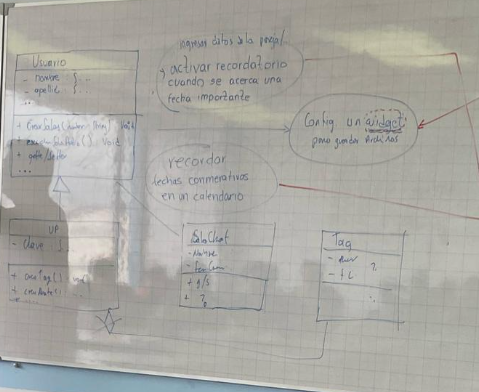
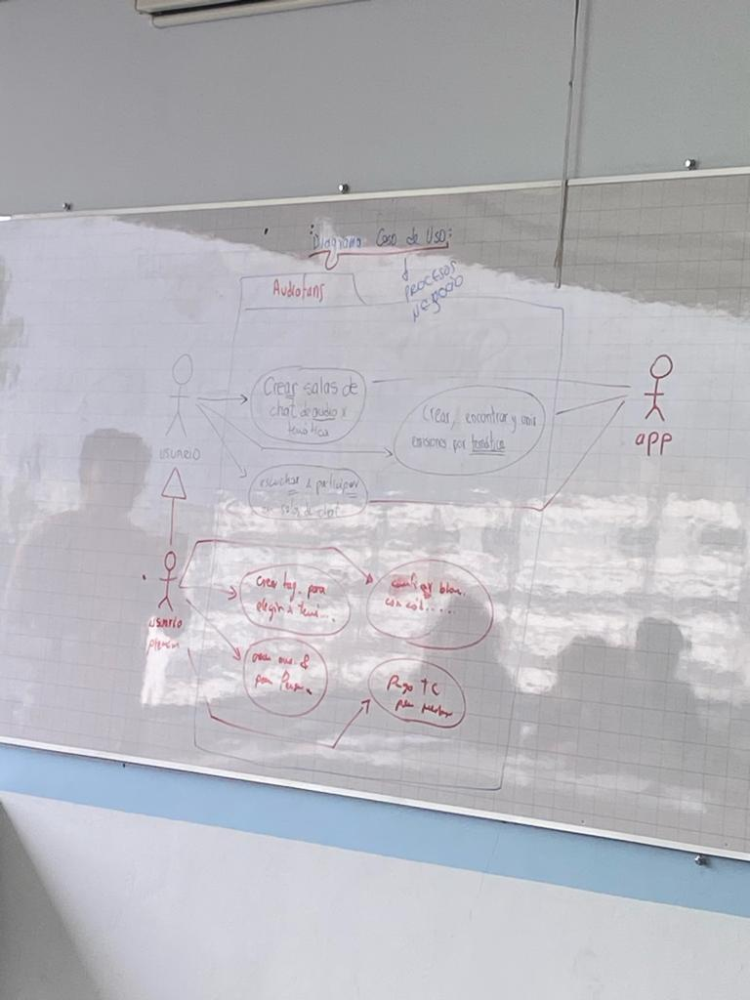
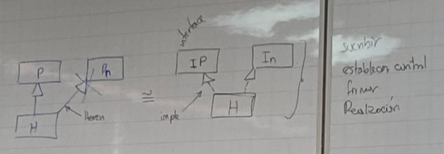
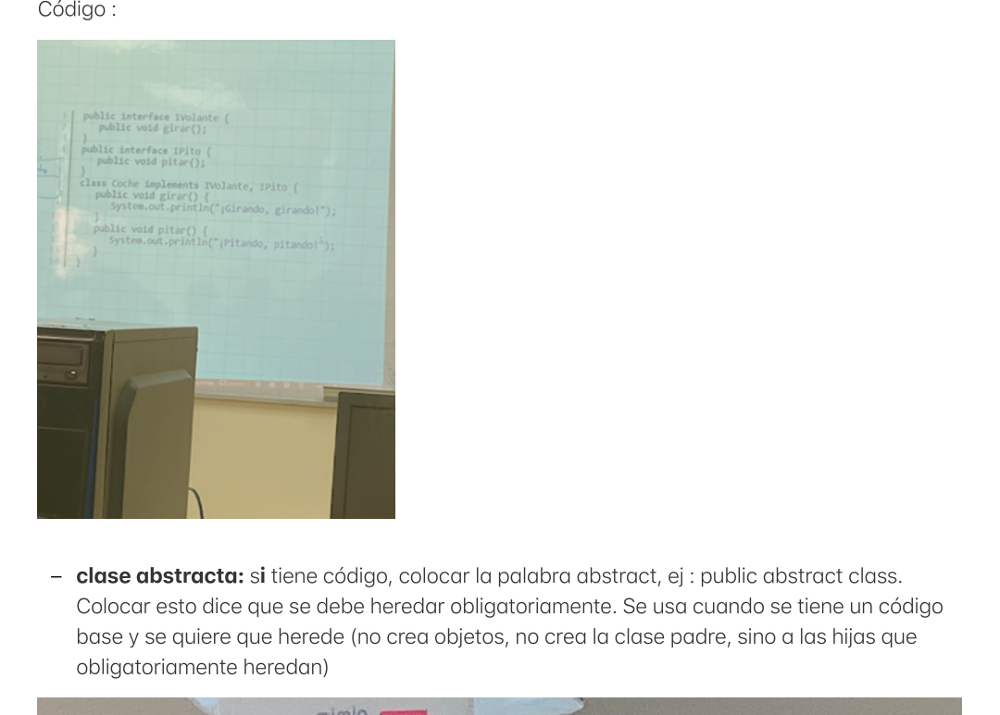
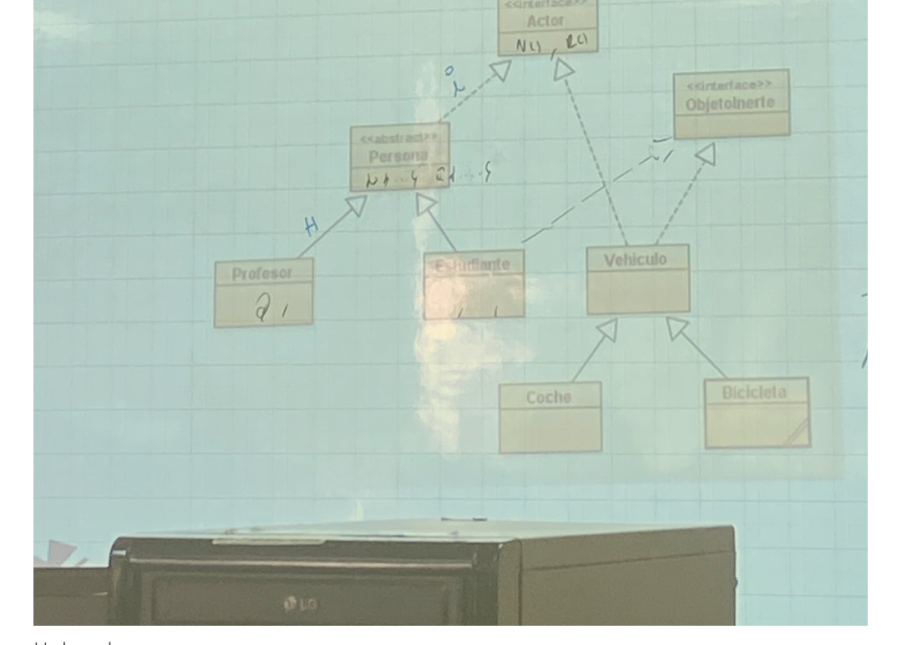

# Clase 0

*06/11/2023*

Presentacion del docente.

# Clase 1

*07/11/2023*

Introducción a los temas que se tratarán.

# Clase 2

*08/11/2023*

1. Abrir terminal
2. windows:             CTRL+SHIFT+P
3. quick ope:           CTRL+P  
4. toggle sidebar:      CTRL+B
5. multi-select cursor: CTRL+ALT, CTRL+F2, ALT+SHIFT+RATON
6. copy line:           SHIFT+ALT+UP, ALT+SHIFT+DOWN
7. comment code block:  SHIFT+ALTA+A (multi-line comment), CTRL+K+C (single-line)
8. goback/move forward ALT -> or+
9. Trigger suggestion and Trigger parameter hints: CTRL+SPACE,CTRL+SHIFT+SPACE
10. line cut:           CTRL+X
11. previsualizacion:   CTRL+SHIFT+V
12. limpiar terminal:   CTRL+L

----------------------------------
markdown

# titulo1

## subtitulo2

### titulo3

...
**palabras en negrita**

*palabras en cursiva*

***palabras en negrita y cursiva***

~~texto tachado~~

...
[google](www.google.com)


------------------------------------------------------------
------------------------------------------------------------

# Clase 3

*09/11/2023*

Apuntes en el git

El git recopila las conexiones y cambios

### Git

Fue creado en 2005 por Linus Torvalds

Facilita el trabajo colaborativo

### Comandos de Git

- **Comprobar las versiones de git:**

  git --version

  git -v

- **Ayuda de git**

  git -h

  git --help

- **Pull:** para bajar cambios anteriores

- **Push:** para subir los cambios al proyecto

- **Clone:** copia un repositorio a tu computadora local

- **Commit:** guarda los cambios realizados en la carpeta actual

- **Fetch:** comando para forzar el proceso y hacer que el programa funcione

-----------------

**Notas:** 

En la industria el 70% de la infraestructura esta en linux

El kernel de MacOs se basa o es linux

-----------------

### Comandos de Linux

- todos los comandos de git llevan "git", y los que no entonces seran de windows

  limpiar terminal:   ***clear***

  limpiar terminal:   ***CTRL+L***

                      cd/home/usuario/proyecto_git 

listar:                     ***ls -l***

ubicacion de las carpetas(directorio actual):  ***pwd***

ver todos los directorio: ***ls***

mostrar lo que hay dentro de un archivo:  ***cat***

### Comando git

inicializar repositorio:       ***git init***

ver la version del git:        ***git --version***

configurar nombre:             ***git config --global user.name "name"***

configurara correo:            ***git config --global user.email "email"***

permite agregar archivos, archivos que no estan siendo respaldados:                   ***git add***

como esta el estado en el background:                                                 ***git status***

autocompletado:                 ***tab***

 para subir todos los archivos:  ***git add .***

 guardar cambios: ***git commit***

 cear archivo: ***touch***

 crear un archivo y escribir dentro de el: ***echo "hola" > file.txt***

para abrir un archivo pero no en la terminal: ***code .gitignore***

para crear archivo con su nombre: ***touch name.txt***
unificar una rama: ***git merge***
craer
 una rama: ***git branch***

## Comandos terminal y git

- acceder a todos los directorios: ls
- volver hacia atras: cd ..

- directorio anterior: ls

- saber cual es la ruta(lugar en el que se encuentra en el equipo): ***pwd***

- crear carpetas: ***mkdir "nombre_de_la_carpeta"***

- desplazarce dentro de la carpeta: ***cd nombre_de_la_carpeta\ Git***

- limpiar consola: ***clear***

- configuracion global(cualquiera que tengo el usuario podra hacer cambios): ***git config --global***

- crear un fichero de cogido: ***touch nombre.java***

- cambiar el nombre de la rama: ***git branch -m main***

- borrar una rama: ***git push origin :branchName***
    main será la rama principal del proyecto

- crear commits(toma fotografias de cada avance): ***git commit -m "Este es mi commit Nro"***

- crear fotografias del proyecto (guardarlo): ***git add nombre_del_acrhivo.java***

- como ver si la fotografia se ha realizado: ***git log***

- para eliminar un archivo: ***rm nombre_del_archivo.java***

- para ver el contenido de un archivo: ***cat nombre_del_archivo***

- volver para atras a la ultima fotografia: ***git checkout nombre_del_archivo.java***

- para regresar mas antes: ***git reset***

- para ver todo de mejor forma: ***git log --graph --pretty=oneline***

- abreviar los commits: ***git log --graph --decorate --all --oneline***

- archivo oculto(ocultar un fichero): ***touch.gitignore***

- sin realizar una fotografia ver lo que ha ido cambiando: ***git diff***

- ver diferencias entre dos versiones: ***git diff betweenVersions***

- subir todos los cambios al repositorio: ***git push origin master***

# Clase 4

*Fecha: 13/11/2023*

- Antes de cambiarse de rama, en el git hacemos un **git status** para saber si podemos perder alguna actualizacion de informacion.

- Si se realiza cambios sin guardar es posible volver a la anterior rama y recuperarlo

Para crear un archivo de java debe cumplir dos condiciones

1. Debe comenzar con mayuscula

2. La clase debe tener el mismo nombre del archivo

***.Git merge***: ayuda a unificar las ramas

***echo Hi_Ismael> "java"*** ayuda a crear el archivo y darle la extension que necesito 

- Al final subir toda a git hub para que no se pierda la informacion reciente, esto es posible con un ***git push***

- Para subir la info a Github se usa:

 ***git push -u*** y la direccion de nuestro git hub

**Ejemplo:**

    git push -u https://github.com/Ismael-18/clases.git

* Usos de Java

1. Desarrollo de videojuegos

2. Realidad virtual

3. Desarrollo web

4. Desarrollo de Apps moviles

* Empresas que lo usan usan

1. Netflix

2. Twitter

3. Netflix


# Clase 5

 *Fecha: 14/11/2023*

- parametro: sirve para caracterizar al metodo, le da las particularidades para que ejecute

- todos los bucles siempre tienen un condicional definido

- ambito o tambien conocido como modificador de acceso:

**¿Que es?**

Tiene tres posibilidades que son: public (para todos, todos lo pueden ver, tiene acceso publico, en general las clases seran publicas)
                                 protected (solo "amigos")
                                 private   (solo "yo")

- **private:** solo puede ser utilizada dentro de la clase en la cual fue declarada

- **protected:** puede ser utilizada por cualquier clase hija y en su propia clase

- **public:** puede ser utilizada desde cualquier lugar

---------

# Clase 

*15/11/2023*

***Actividad, Evento de Bienvenida 2023B en el teatro Politecnico***

# Clase 6

*16/11/2023*

*crear por medio del constructor

*el constructor, caracteristicas:

-es un "metodo" publico, no puedo ser privado porque alguien tiene que llamarlo.

-debe ser unico y tener el mismo nombre de la clase

-sino se lo coloca se autodefine

-se auto-ejecuta con "new" y una unica vez

-cada vez que se coloca "new" se crea un espacio en memoria para almacenar este objeto

(aquel que construye el objeto)

```js

instancia = {crear -> utilizar un constructor - new(luego llamarlo, new lo llama)}

```
- **Nota:** el punto rojo que aparece al lado de cada linea de codigo se llama punto de corte para poder detener desde ahi el programa y poderlo arrancar

## objetos

- el computador lee la sentencia new, separa un espacio de memoria RAM para que pueda estar este objeto. Una vez en la RAM se necesita "algo" para poder ingresar y darle nombres

- recolector de basura esta encargado de limpiar la ram

# Clase 7

*20/11/2023*

# Clase 8

*21/11/2023*

# Conferencia

**Semana:** *22/11/2023 al 24/11/2023*

# Clase 9

*27/11/2023*

# Clase 10

*28/11/2023*

# Clase 11

*29/11/2023*

# Clase 12

*30/11/2023*

# Clase 13 

*04/12/2023*

# Clase 14

*05/12/2023*

# Clase 15

*06/12/2023*

- Clase pública: para que el computador lo pueda ver.

- Código:

```js

public class TarjetaCredito{   //en singular

  //propiedades de tipo privado ya que si fuese público esto crearía que pudiesen cambiar su valor (private es un nivel de protección)

  //luego se generará un canal para darle el nivel de acceso

  //declaración de variables y nombre completo

  //camelCase

  private String nombreUsuario;

  private String numeroTarjeta;

  private String dato;

  private String clave; //falta el get y el set

  private Date; //almacenar una fecha y hacer get y set

// string.format(“mm/yy”, fecha)

  //getter setter

//showTC(); para mostrar

   public void setDato(String Dato){

      if(Dato.length > 0)

         if(Dato.equals(“xyz”))

            this.dato = dato;
 }

public void getDato(){
   return dato.upperCase().substring(4);
}

//Metodos

public String cambiarClave(String claveAnterior, String claveNueva String ClaveNuevaReescribir){

    String observación = “”;

    if(!claveAnterior.equals(getClave())){

      observación += “Clave anterior no es igual \n”;

    }

if(!claveNueva.equals(ClaveNuevaReescribir)){

  observación+= “clave nueva no coincide”;
  
}

//le dice que la clave está bien y que cambie la clave

if(observación .equals(“ ”)){

  setClave(claveNueva);

}

//operador ternario
return (observación.equals(“ ”)? “ok” : observacion);

}

/**regla de negocios: cada empresa tienen sus reglas
 * set: todo lo que ingresará (colocar)
 * get: trabajar la lectura del valor (traer)
 * sout (TarjetaCredito.getDato ()); es equivalente a sout(TarjetaCredito);
 * TarjetaCredito.setDato(“”) equivalente a TarjetaCredito = “toma”;
*/

}

// método:

retirar(cantidad)

cambiarClase (claveAnterior , claveNueva)

pagar(cantidad, localidad)

```

# Clase 16

*07/12/2023*

UML

## 1.- use case

- Es el lugar donde estarán los objetos (ayudará a graficar). Procesos de negocios/módulos (acciones)

- Flecha hacia la izquierda dice que primero se ejecuta el anterior y luego el que apunta

- Flecha hacia la derecha primero el anterior y luego el que le apunta la flecha

- Flecha cerrada indica jerarquía

- Para empezar con el modelado primero se debe conocer a detalle el problema a solucionar

**Ejemplo:**

Supermaxi requiere que las compras de sus clientes se paguen con
tarjeta de crédito insitu con datafast

- buscar un actor: supermaxi, clientes (todos los actores de representan con un muñeco)

- use case: mapea procesos (ir, ar, er)
UC01 //etiquetas

Finalidad de los use case es entender el proceso, el giro de un negocio

El dibujo es el camino a seguir

## 2.- Diagrama de clase

¿Como se representa una clase?

Para representar relaciones entre las clases se tiene también flechas

Cuando se programa todo lo representado se pasará a código

En programación orientada a objetos todo es un objeto


## 3- herencia

Son los “hijos” de la clase

Todo lo que tenga el “padre” lo tendrán los hijos

La clase hijos utiliza la herencia para heredar características comunes de la clase padre

Representación de herencia

"+" : public

"-" : private

"#" : protected

# Clase 17

*11/12/2023*

***Presentacin Poliretos***

# Clase 18

*12/12/2023*

Deber tarjeta:

Clases:

- Usar método show

- String format controlar longitud

# Clase 19

*13/12/2023*

Empezar con las clases dependientes

Para incitar los get/setter

Seleccionar los atributos y presionar en el foco para colocar los getter/setter

**Constructor vacío:** inicializa las variables con “” y sirve para que no se le pase nada y después en un segundo momento se le pueda pasar parámetros

**new** significa crear un nuevo espacio de memoria

```js

Cliente c = new Cliente(definir con que saldrá o iniciará el constructor);

```

**Polimorfismo**: múltiples formas (mismo nombre, puede contener los mismos parámetros pero puede hacer sus propias cosas) tener comportamientos de acuerdo a los parámetros

**Polimorfismo+sobrecarga** (poténcializa al poli) (que es sobrecarga: ligado a los parámetros)

- Lectura clase hija a clase padre es generalizar

- Lectura clase padre a clase hija es especificación

Primero se crea la clase padre y después la clase hija al instanciar

# Clase 20

*14/12/2023*

- **Abstracción**(visión opaca y genérica del problema): nivel de conceptualización básico

—>conforme se sigue creando clases se puede ir teniendo más detalles del objeto



- **Paquetes:** librerías (empaquetar librerías)

**Actores:**

- interactúa con el sistema

- puede ser una persona u otro sistema

**Requerimientos:**

- **Funcionales:** por lo general lo que la empresa dará y desea que se haga

- **No funcionales:** todo lo que no pedirá la empresa pero debe estar presente. Por ejemplo: la seguridad del software, que permita escalar el software (que el software permita aumentar la cantidad de usuarios por ejemplo)

-----------------

Deber:

diagrama caso de uso

Diagrama de clases

Código  

------------------

- En Java no hay librerías hay apis

- Tipos de datos no primitivos son aquellos formados de otro tipo de datos

- Una biblioteca se conforma de métodos

- **CompareTo**: devuelve un entero al comparar dos strings (devuelve la cantidad de caracteres iguales en ambas cadenas)

# Clase 21

*18/12/2023*

- **Corrección**: la fecha de include debe apuntar

Otros dispositivos van como actores(aquellos que solo ayudarán a entender el contexto)

Boundary con cuadrados que ayudan a delimitar hasta donde llega la solución

Las clases hijas solo se pueden extender de una clase padre



Un segmento es una figura

“es una/es un/son” para representar la relación de las hijas con el padre

Será raro cuando se ocupe al papá para actuar



El **borrar()** se encuentra en ambas clases hijas porque no es lo mismo borrar un segmento que un circulo (esto se llama poliformismo)
Polimosfirmo es la particularidad de especificar el mismo método del padre en el hijo

- **Sobrecarga**: ligado al tema de los parámetros (en el ejemplo anterior puede existir un borrar con parámetros y otro sin parámetros; eso se conoce como sobrecarga). También quiere decir que si por un lado de tiene polimosfirmo también se puede tener sobrecarga
- **Encapsulacion o abstracción**: solo interesa que al momento de llamar al método este se pueda realizar independientemente de si se usó polimorfismo u otras cosas

- **Polimorfismo** se lo llama sobre escribir, que dejes de lado el método del papa y tomes el del hijo

- **Renderizar** de los objetos: es dibujar

- **Drag en drop**: arrastrar y soltar

- Si no se tiene un constructor la máquina virtual de Java se encarga de crearlo, por lo que si funciona la línea de código en la que si se instancia la clase

- Cuando se tiene clases hijas toma relevancia el constructor

- Si la clase hija no tiene constructor, primero requiere que el padre tenga un constructor y con parámetros

- Si la clase hija no tiene constructor y la clase padre tiene constructor vacío entonces se podrá ejecutar la línea new (la instanciacion)

- La máquina virtual de Java (JVM) solo pone el constructor cuando no se ha definido nada

- Si está vacío el constructor quiere decir que no tiene ningún parámetro

- Segmento s2; //se ejecuta porque solo está declarando una variable de tipo segmento

- **Súper()** si está con un parámetro llamará al constructor del padre con un parámetro, si tiene dos parámetros llamará al constructor del padre con dos parámetros

- En las clases hijas el constructor puede empezar vacío pero el súper() llama la cantidad de parámetros de cualquier constructor del padre

- Un constructor vacío facilita la creación del objeto (pero deja la puerta abierta a no tener ningún parámetro y si se le pasa parámetros imprimirá nulo porque el contractor no tiene ninguno)

- ***Shitf+Crl+P + create***

- ***Shift + Crtl + V***

- Super pasa los parámetros a la clase padre

- Para programa puntos extras: Presentar diagrama caso de uso , clase y programa

- Menú

- Actor: jugador

# Clase 22

*19/12/2023*

- Cuando un constructor tiene múltiples parámetros se llama sobrecarga

- Para ejecutar un control hijo y el del papá igual se lo hacer

```js

// Constructor padre:

      public padre (){}

      //Método padre: 

      bailar()

// Constructor hijo:

      public hijo(){

      //bailar padre, esta llamando al padre 

      súper.bailar()

      //bailar hijo 

      bailar()

      //llamar directamente al padre si tiene diferente nombre…ejemplo:
  
      stop();

      }

      // metodo

```
**@Override:** esto indica que está sobre escribiendo el bailar() del padre

```js

      public void bailar(){
   
      Sout (“Hijo bailando”)
      
      }

      //aquí no es necesario colocar un override ya que solo existe un método con parámetros y está en el hijo 
      
      public void bailar(String genero ){
   
      Sout (“Hijo bailando”+genero)

      }

```

**@Override**: Para sobre escribir el método del papa

- Sobre carga el método es darle más parámetros

- No se válida el nombre de un parámetro, sino el tipo de parámetro (esto en un ejemplo de sobre escritura)

- Paquete es aquel que empaqueta varias clases (abreviación pk)

- Para crear un paquete en java: ***Crl+P + escribir package + nombre***

En el main llamarlo

- Antes del class, es “.Clase” para llamar una sola clase del paquete: import pkUtilitario.Animal;

- Para llamar a todo el paquete: import pkUtilitario.*;

- En el main: Animal a = new Animal();

# Clase 23

*20/12/2023*

final —> estático, constante (variables)

final int

Constantes en java llevan su nombre en mayúsculas

# Clase 24

*21/12/2023*

***Prueba 1***

# Semana

**del 25 al 01 Enero** semana da vacaciones

- ***Operadores Ternarios***: sirve como un if, arrojan valores verdaderos o falsos

ej:

```js

variable = (condicion) ? valor_sies_verdadero : valor_sies_falso

```

# Clase 25

*02/01/2024*

Revisión de la prueba.

Crear y guardar archivos de texto.





# Clase 26

*03/01/2024*



- Interfase siempre de denota con una “I” mayúscula al inicio

- La interfase permite describir comportamientos traducido a operaciones/comportamientos

- Las operaciones se “heredan” también en las interfases

- Se le llama un “contrato”, es una obligación, cuando se implemente en la interfaz hija va a cumplir lo del padre

- Interface solo define la operaciones en la interfaz padre no pone nada de código solo se define el método. Y en la interfaz hija se implementa y se ingresa código (es obligatorio)

- En herencia se instancia pero en interfaces no se instancia, es decir, no se hace: Ip ip = new Ip();

-Fomenta el polimorfismo

- La implementación debe darse con el número de métodos

- Permiten y generan conexiones

- Interface también se llama **realización**

- Es una línea con flecha entre cortada

- También se puede colocar propiedades, pero estas se crean como constantes (automáticamente). En cambio, al heredad la clase padre debe tener “final static” para poder colocar una constante.  

Código :



- clase abstracta: si tiene código, colocar la palabra abstract, ej : public abstract class. Colocar esto dice que se debe heredar obligatoriamente. Se usa cuando se tiene un código base y se quiere que herede (no crea objetos, no crea la clase padre, sino a las hijas que obligatoriamente heredan)



- **H :** hereda

- **i :** implementa

Operaciones básicas de una base de datos:

- **crud :** guardar

- keep

-----------------
Para el examen:

Arraist

Archivos de texto: leer, guardar y mostra

-----------------

# Clase 27

*04/01/2024*

Examen Bimestral
